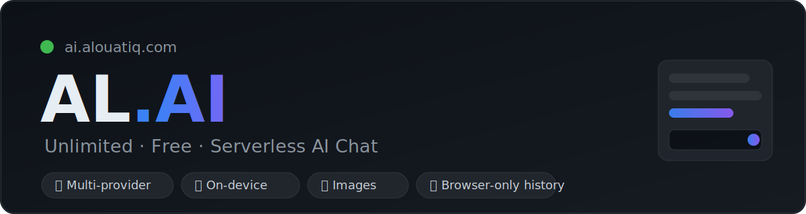
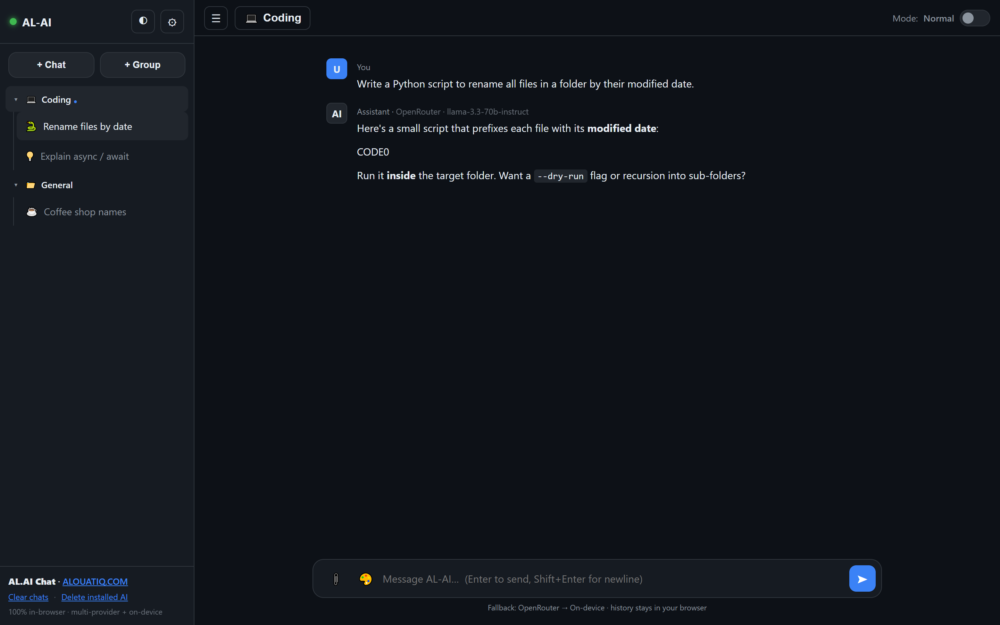
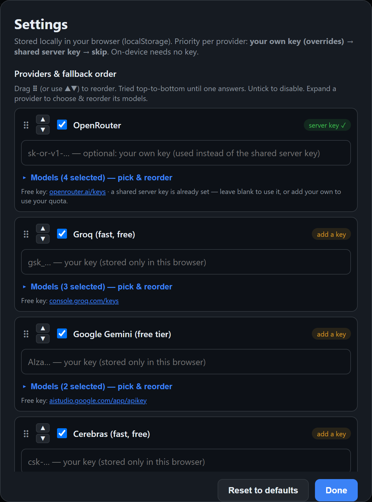
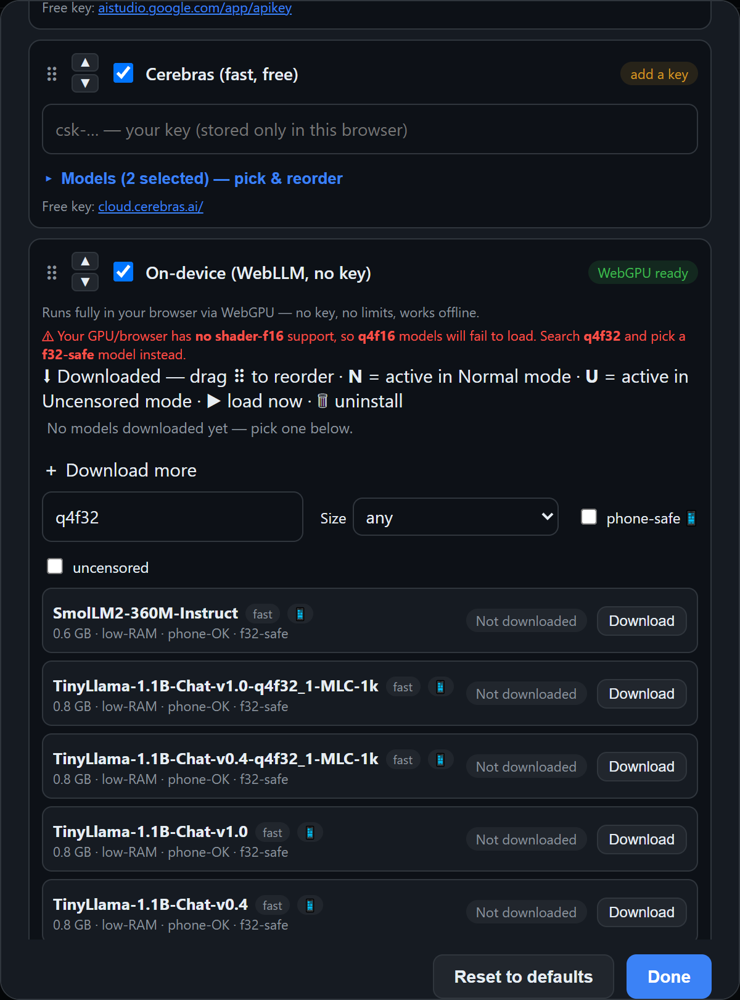
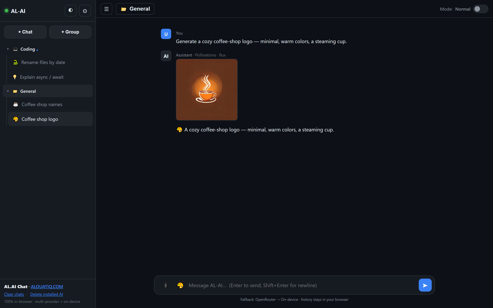

<p align="center">
  <a href="https://ai.alouatiq.com"></a>
</p>

<h1 align="center">AL.AI — Unlimited · Free · Serverless AI Chat</h1>

<p align="center">
  A ChatGPT-style AI chat that runs on <b>free</b> AI providers, needs <b>no backend</b>, and keeps your history <b>only in your browser</b>.<br>
  Multi-provider fallback · on-device models (WebLLM) · image generation & editing · groups · file attachments.
</p>

<p align="center">
  <a href="https://chat.alouatiq.com"></a>
  <a href="LICENSE"></a>
  <a href="CONTRIBUTING.md"></a>
  
</p>

<p align="center">
  <a href="#-features">Features</a> ·
  <a href="#-quick-start">Quick start</a> ·
  <a href="#-deploy-your-own">Deploy</a> ·
  <a href="#-how-it-works">How it works</a> ·
  <a href="#-contributing">Contributing</a> ·
  <a href="#-license">License</a>
</p>

---

## 📬 Contact

| | |
|---|---|
| **Author** | AL OUATIQ |
| **App** | <https://ai.alouatiq.com> |
| **Website** | <https://alouatiq.com> |
| **Email** | contact@alouatiq.com |
| **GitHub** | [@alouatiq](https://github.com/alouatiq) |

Questions, ideas or feedback are welcome — open an [issue](../../issues) or reach out.

---

## 🎯 What is this?

**AL.AI** is a single-file, backendless AI chat app. It talks **directly** from your browser to
free AI providers, falling back across them automatically so you (almost) always get an answer —
and when the cloud is rate-limited, it can run a model **fully on your device** with no key at all.

- **No server of ours** ever sees your messages — the only network calls go to the AI providers you choose.
- **Your chat history lives only in your browser** (`localStorage`).
- **Deploy your own** in minutes on Vercel, or just open `index.html`.

> ⚡ Try it now: **[ai.alouatiq.com](https://ai.alouatiq.com)** — no signup, no key required.

---

## ✨ Features

### 🔌 Providers & reliability
- **Multiple free providers** — OpenRouter, Groq, Google Gemini, Cerebras (all OpenAI-compatible).
- **Two-level automatic fallback** — walks your provider order, and within each provider walks its model list, until one answers. Rate-limited or failing model? It moves on.
- **Bring-your-own-key** — every visitor can paste their **own** key for any provider, which **overrides** the shared server key (their quota, stored only in their browser).
- **Self-healing model list** — pulls OpenRouter's live free-model list so model names never go stale.

### 🖥 On-device AI (WebLLM)
- Download a model that runs **fully in your browser** via WebGPU — **no key, no rate limits, works offline**.
- **Downloaded models pinned at the top**: drag to reorder, click **N**/**U** to set the active model for Normal / Uncensored mode, **▶** to warm it into memory, **🗑** to uninstall.
- Live catalogue with **size**, **install status**, and filters for **size / phone-safe / uncensored**.
- Detects missing **`shader-f16`** support and steers you to compatible **`q4f32`** models.

### 🎨 Images
- **Generate** images from text — **Pollinations · FLUX**, free & keyless, with a **style picker** (flux, realism, 3D, anime, turbo).
- **Edit / improve** an image — attach a photo and 🍌 **Nano Banana** (`gemini-2.5-flash-image`) transforms it.
- **Fallbacks** — HuggingFace **FLUX** for generation and **Qwen-Image-Edit** for editing (optional HF token).

### 💬 Chat experience
- **Groups (projects)** — each group holds a **system prompt** shared by all its chats; custom **name + icon**.
- **Editable chats** — rename and pick a custom **emoji icon** per chat.
- **File attachments** — images, PDF and text via 📎 button, **drag-drop**, or **paste**. Vision models read images; text is inlined.
- **Normal / Uncensored** toggle. Streaming responses. Markdown + code blocks with copy buttons. Light/dark theme. Mobile-friendly.

### 🔐 Privacy & simplicity
- **History and settings never leave your browser.**
- **Keys stay secret** — server keys live in Vercel env vars (proxied by an Edge function); your own key is browser-only.
- **Zero dependencies, no build step** — one HTML file + tiny Edge functions.

---

## 📸 Screenshots

> Add PNGs to [`docs/screenshots/`](docs/screenshots/) and they'll appear here.

| Chat + groups | Providers & fallback |
|---|---|
|  |  |
| **On-device models** | **Image generation** |
|  |  |

---

## 🚀 Quick start

### Use the hosted app
Just open **[ai.alouatiq.com](https://ai.alouatiq.com)** — it works out of the box (shared free key), or add your own in ⚙ Settings.

### Run locally
```bash
git clone https://github.com/alouatiq/AL.AI-Unlimited_FREE_CHAT.git
cd AL.AI-Unlimited_FREE_CHAT

# Simplest — static file server (paste your own key in ⚙ Settings):
npx serve .
# then open the printed http://localhost:xxxx
```

You'll need a free key from any provider (e.g. [openrouter.ai/keys](https://openrouter.ai/keys)) — or just enable **On-device** and download a model (no key needed).

---

## ☁️ Deploy your own

[](https://vercel.com/new/clone?repository-url=https%3A%2F%2Fgithub.com%2Falouatiq%2FAL.AI-Unlimited_FREE_CHAT)

1. Click the button (or `vercel` from the CLI).
2. Add **any** of these Environment Variables in **Vercel → Settings → Environment Variables** — each enables that provider's server key so your visitors need nothing:

   | Variable | Provider | Get a free key |
   |----------|----------|----------------|
   | `OPENROUTER_API_KEY` | OpenRouter | <https://openrouter.ai/keys> |
   | `GROQ_API_KEY` | Groq | <https://console.groq.com/keys> |
   | `GEMINI_API_KEY` | Google Gemini (+ 🍌 image editing) | <https://aistudio.google.com/app/apikey> |
   | `CEREBRAS_API_KEY` | Cerebras | <https://cloud.cerebras.ai> |
   | `HF_TOKEN` | Hugging Face (image fallbacks) | <https://huggingface.co/settings/tokens> |

3. Redeploy. Done — no framework; Vercel serves `index.html` statically and runs `api/*` as Edge functions.

**Local dev with functions:**
```bash
cp .env.example .env.local   # add at least OPENROUTER_API_KEY
npx vercel dev
```

---

## 🧠 How it works

```
Browser (index.html)
   │
   │  1) your own key?  ──► call the provider directly
   │  2) server key?    ──► /api/chat  (Edge fn adds the secret key)
   │  3) on-device?     ──► WebLLM runs the model in your GPU (no network)
   ▼
Free AI providers  ·  or your own hardware
```

| File | Role |
|------|------|
| `index.html` | The entire frontend — UI, fallback logic, WebLLM, image engines, storage. Self-contained, no build. |
| `api/chat.js` | Edge function — proxies chat to the chosen provider using its **server-side** key. |
| `api/models.js` | Edge function — live OpenRouter free-model list + which providers have a server key. |
| `api/image.js` | Edge function — proxies 🍌 Nano Banana (Gemini) image generation/editing. |
| `api/hf.js` | Edge function — proxies Hugging Face image models (FLUX / Qwen-Image-Edit). |

**Key priority per provider:** `your own key (overrides) → shared server key → skip`. On-device needs no key.

---

## 🗺 Roadmap / ideas

- [ ] Drag a chat between groups
- [ ] Export / import chats (JSON)
- [ ] More image engines & video
- [ ] Auto-title chats from the first reply
- [ ] PWA / installable offline app

Have an idea? [Open an issue](../../issues) — see [Contributing](#-contributing).

---

## 🤝 Contributing

Contributions are welcome and appreciated! It's a dependency-free, single-file app, so it's easy to hack on.
See **[CONTRIBUTING.md](CONTRIBUTING.md)** for setup and guidelines. Good first areas: new providers, UI polish, docs, translations, accessibility.

---

## 🔒 Privacy

- Your **messages, chats, groups and settings** are stored **only in your browser** (`localStorage`) — never on our servers.
- The **only** outbound requests are the AI API calls to the provider you're using (via your key or the deployment's server key).
- **On-device** mode sends nothing over the network at inference time.

---

## 🙏 Acknowledgements

Built on the shoulders of great free/open projects: [OpenRouter](https://openrouter.ai), [Groq](https://groq.com),
[Google AI Studio](https://aistudio.google.com), [Cerebras](https://cerebras.ai), [MLC WebLLM](https://github.com/mlc-ai/web-llm),
[Pollinations](https://pollinations.ai), and [Hugging Face](https://huggingface.co).

---

## 📜 License

Released under the **[MIT License](LICENSE)** © 2026 AL OUATIQ. Free to use, modify and distribute.

> "Uncensored" models simply refuse less; they are still bound by each provider's terms and the law where you live. Use responsibly.

---

<p align="center">
  <b>AL.AI Chat</b> · built by <a href="https://alouatiq.com">AL OUATIQ — ALOUATIQ.COM</a><br>
  <a href="https://ai.alouatiq.com">🌐 ai.alouatiq.com</a> · ⭐ Star this repo if you find it useful!
</p>
